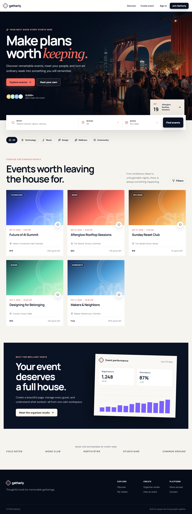
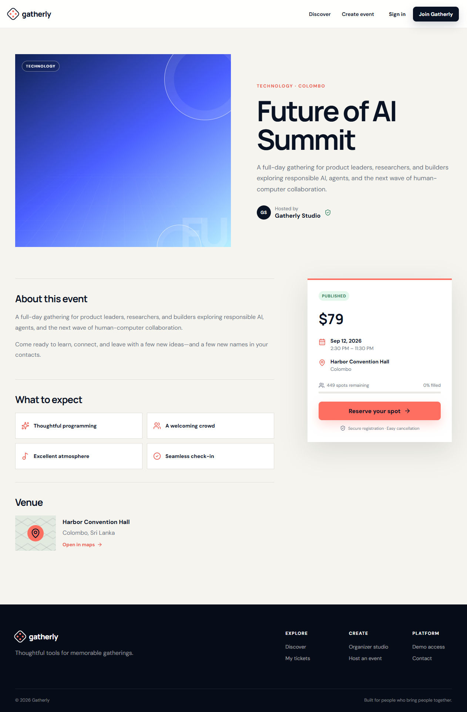
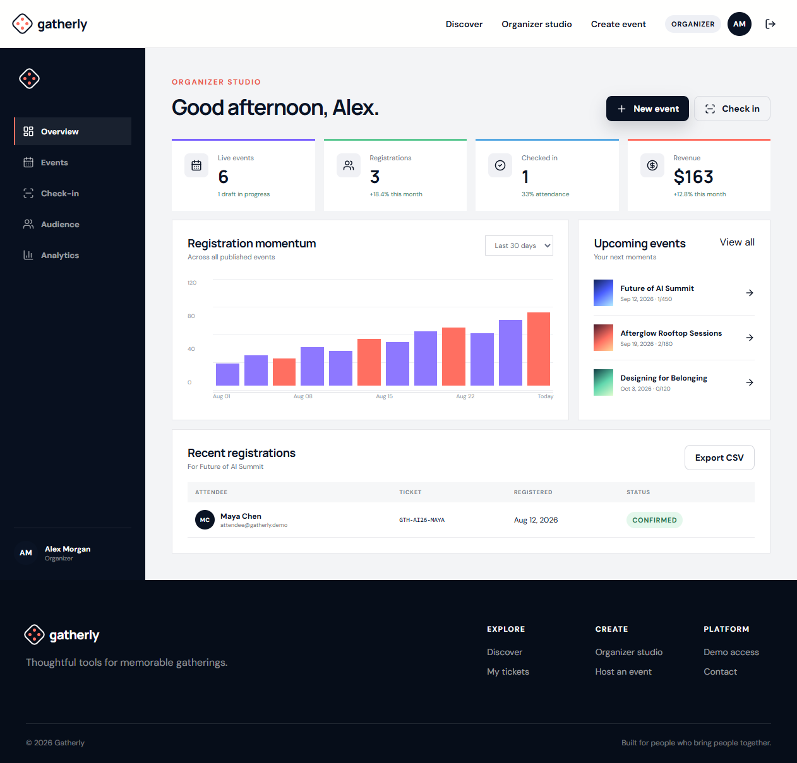
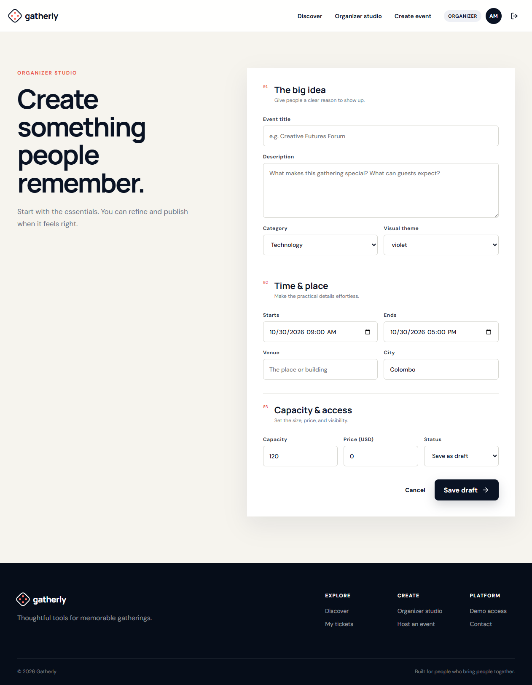
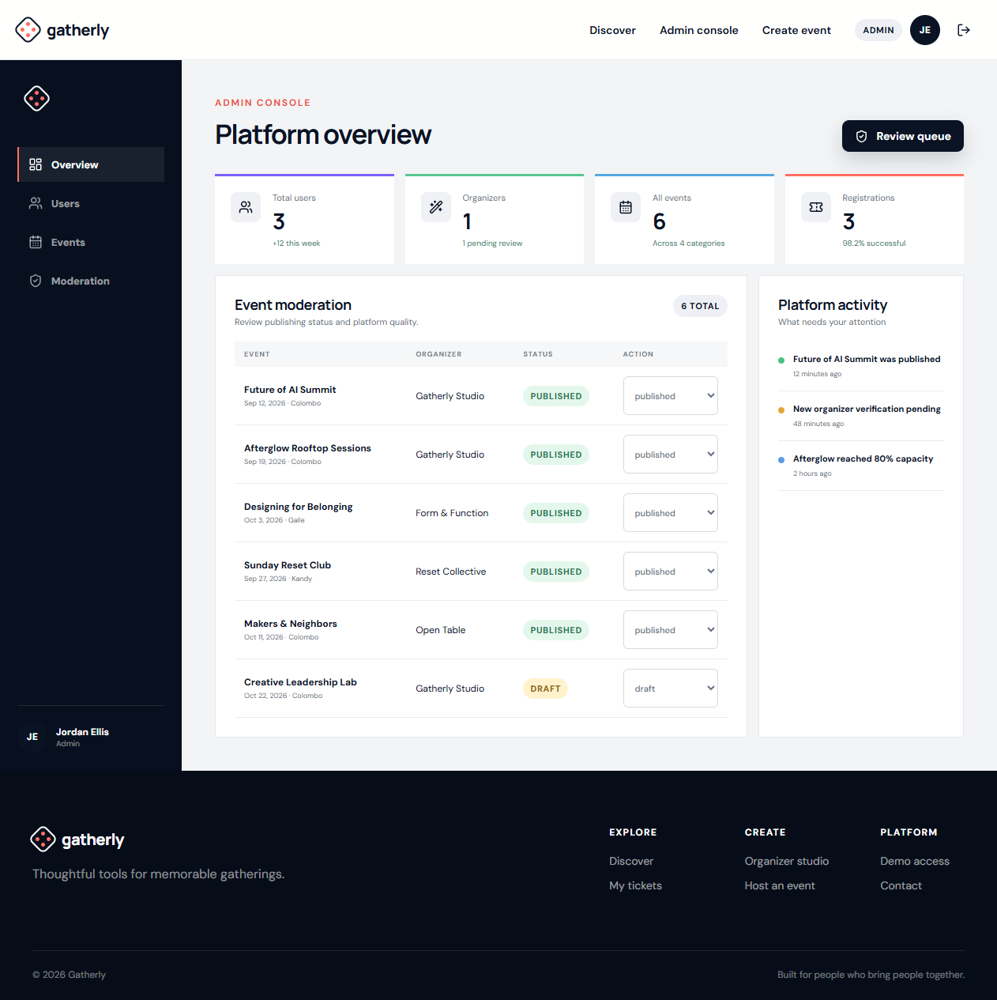

# Gatherly — Event Management Platform

Gatherly is a polished full-stack event discovery and operations platform. Attendees can find and register for events, organizers can publish experiences and manage attendance, and administrators can moderate the platform from one responsive workspace.

The application is based on the supplied Event Management System project blueprint and ships with seeded demo data, three role-based accounts, a REST API, automated API tests, and portfolio-ready screenshots.

## Highlights

### Attendees

- Search public events by keyword, category, and city
- Review event details, venue, time, price, and live capacity
- Register for a confirmed ticket or join the waitlist when capacity is reached
- Receive a unique ticket code and manage cancellations
- View upcoming and historical registrations

### Organizers

- Role-protected organizer studio with performance metrics
- Create draft or published events with validation
- Review event capacity and attendee registrations
- Check in guests using a unique ticket code
- Track registration, attendance, and revenue summaries

### Administrators

- Platform-wide user, event, and registration metrics
- Event moderation queue and status controls
- Role-protected admin routes
- Recent platform activity overview

## Product screens

| Event details | Organizer studio |
| --- | --- |
|  |  |

| Create event | Admin console |
| --- | --- |
|  |  |

## Technology

- React 19, Vite, React Router, and Lucide icons
- Node.js, Express 5, Zod, JWT, bcrypt, Helmet, CORS, and rate limiting
- Mongoose schemas for users, events, registrations, and check-ins
- Node test runner and Supertest for API coverage
- Agent Browser for repeatable Chrome-based UI verification

## Architecture

    Event-Management-System/
      client/
        public/images/       Original product imagery
        src/
          App.jsx            Routes, role flows, and UI components
          main.jsx           React entry point
          styles.css         Responsive product design system
      server/
        src/
          config/            Database bootstrap
          models/            Mongoose domain schemas
          app.js             REST API, validation, auth, and demo repository
          server.js          Application entry point
        tests/               API and authorization tests
      screenshots/           Verified portfolio screens

## Run locally

Requirements:

- Node.js 22 or later
- npm 10 or later
- MongoDB is optional for local UI evaluation

Install and start both applications:

    npm install
    npm run dev

Open:

- Client: http://localhost:5173
- API health check: http://localhost:5000/api/health

The application starts in seeded demo mode when no database URI is supplied, so every screen is immediately usable. To prepare a local environment file:

    Copy-Item server/.env.example server/.env

The current portfolio release includes the MongoDB connection bootstrap and Mongoose schemas. The seeded repository remains the active adapter so reviewers can run the complete workflow without external infrastructure; replacing it with the persistent Mongoose repository is listed in the roadmap.

## Demo accounts

All seeded accounts use the password \`demo123\`.

| Role | Email | Start page |
| --- | --- | --- |
| Attendee | attendee@gatherly.demo | Event discovery |
| Organizer | organizer@gatherly.demo | Organizer studio |
| Admin | admin@gatherly.demo | Admin console |

The sign-in screen also provides one-click access for each role.

## Commands

    npm run dev
    npm test
    npm run build
    npm start

\`npm start\` serves the built client from the Express server after \`npm run build\`.

## REST API summary

| Method | Endpoint | Access |
| --- | --- | --- |
| GET | \`/api/health\` | Public |
| POST | \`/api/auth/login\` | Public |
| POST | \`/api/auth/register\` | Public |
| GET | \`/api/events\` | Public |
| GET | \`/api/events/:id\` | Public |
| POST | \`/api/events/:id/register\` | Attendee |
| DELETE | \`/api/events/:id/register\` | Attendee |
| GET | \`/api/me/registrations\` | Attendee |
| POST | \`/api/organizer/events\` | Organizer |
| PUT | \`/api/organizer/events/:id\` | Organizer |
| GET | \`/api/organizer/events/:id/registrations\` | Organizer |
| GET | \`/api/organizer/stats\` | Organizer |
| POST | \`/api/registrations/:id/checkin\` | Organizer/Admin |
| GET | \`/api/admin/overview\` | Admin |
| PATCH | \`/api/admin/events/:id/status\` | Admin |

All responses use a consistent \`success\`, \`message\`, and \`data\` shape. Validation errors include field-level details.

## Security and quality

- Passwords are hashed with bcrypt
- JWTs expire after eight hours
- Backend role checks protect attendee, organizer, and admin routes
- Organizer-owned resources are checked before access
- Authentication routes are rate limited
- Helmet, bounded JSON parsing, CORS configuration, and centralized errors are enabled
- Four API tests cover health, search/filtering, registration, and role denial
- Production build and desktop/mobile Chrome verification are included in the release process

## Environment variables

| Name | Purpose |
| --- | --- |
| \`PORT\` | Express port; defaults to 5000 |
| \`MONGODB_URI\` | Optional MongoDB connection string |
| \`JWT_SECRET\` | Long random signing secret |
| \`CLIENT_URL\` | Allowed production client origin |
| \`NODE_ENV\` | \`development\`, \`test\`, or \`production\` |

Never commit a populated \`.env\` file.

## Known limitations and roadmap

- Replace the seeded repository with the persistent Mongoose adapter for production data
- Add paid ticket checkout and refund handling
- Generate scannable QR images in addition to the unique ticket code
- Add email delivery, calendar export, and ticket PDFs
- Add end-to-end tests for every role workflow
- Deploy the client, API, and MongoDB database

## Verification

- \`npm test\`: 4 passing API tests
- \`npm run build\`: successful Vite production build
- Chrome checks: landing, event details, authentication, organizer analytics, create event, ticket check-in, admin moderation, and 390 px mobile layout
- Browser checks found meaningful content, no framework error overlay, and no captured console errors

The original rooftop hero image was generated specifically for this project and is stored at \`client/public/images/gatherly-hero.png\`.
